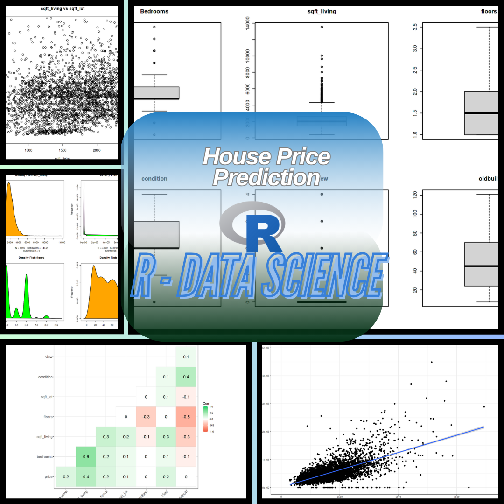

<div align="center">

# 🏡 House Price Prediction — R Data Science Project


> **Accurately estimating real estate prices through advanced statistical analysis and machine learning in R.**

[](https://www.r-project.org/)
[](https://xgboost.readthedocs.io/)
[](https://getbootstrap.com/)
[](https://Abdou-rahmoun-r-house-price-prediction.vercel.app/)

---

**Author :** [Rahmoun Rayan Abderrahime](https://rahmoun-r-house-price-prediction.vercel.app//) &nbsp;|&nbsp; **Published :** October 21, 2024 &nbsp;|&nbsp; **Domain :** Data Science · Machine Learning

</div>

---

## 📋 Table of Contents

- [📖 Project Overview](#-project-overview)
- [🔬 Data Science Pipeline](#-data-science-pipeline)
- [🤖 Model — XGBoost](#-model--xgboost)
- [🗂️ Project Structure](#️-project-structure)
- [🛠️ Tech Stack](#️-tech-stack)
- [🎨 Frontend Architecture](#-frontend-architecture)
- [🚀 Live Demo](#-live-demo)
- [👤 Author](#-author)

---

## 📖 Project Overview

This project is a complete **Data Science & Machine Learning pipeline** built entirely in **R**, focused on predicting residential house prices from structured tabular data. The results are presented through a polished, responsive **web interface** that embeds the full interactive notebook, making insights accessible to both technical and non-technical audiences.

<div align="center">



</div>

---

## 🔬 Data Science Pipeline

The analysis follows a rigorous, end-to-end machine learning workflow:

|             Step             | Description                                                                                        |
| :--------------------------: | :------------------------------------------------------------------------------------------------- |
|   📊 **Data Exploration**    | Examined dataset structure, distributions, and key statistical properties influencing house prices |
|   🔍 **Feature Selection**   | Identified the most impactful predictor variables to reduce noise and improve generalization       |
| 🔗 **Correlation Analysis**  | Built correlation matrices and scatterplot matrices to assess inter-feature relationships          |
|   📦 **Outlier Detection**   | Used boxplots to identify and handle extreme values in the dataset                                 |
|  📈 **Trend Visualization**  | Scatterplots to analyze directional relationships between predictors and target                    |
|    📐 **Normality Check**    | Density plots to assess normality assumptions for the regression model                             |
| 📉 **Univariate Regression** | Implemented linear regression using `sqft_living` as the primary predictor                         |
|   🤖 **XGBoost Modeling**    | Applied gradient boosting for higher-accuracy price prediction                                     |
|     🌐 **Export & Web**      | Converted the Jupyter/R notebook to HTML for clean, shareable web presentation                     |

---

## 🤖 Model — XGBoost

The core predictive model leverages **XGBoost (Extreme Gradient Boosting)**, a powerful ensemble algorithm known for:

- ⚡ Fast training with optimized gradient boosting trees
- 🛡️ Built-in regularization to prevent overfitting
- 📊 Native support for feature importance ranking
- 🔄 Ability to handle missing values and non-linear patterns

The model targets **house sale price** as the output variable, trained on key features including `sqft_living`, bedroom count, bathroom count, location, condition, and grade.

---

## 🗂️ Project Structure

```
R-HousePricePrediction/
│
├── 📄 index.html                          — Main web interface (sidebar + content layout)
│
├── 📁 ConvertedNotebooks/
│   └── house-price-prediction-using-r-programming.html  — Full interactive R notebook (HTML export)
│
├── 📁 css/
│   ├── style.css                          — Compiled main stylesheet (224 KB)
│   ├── bootstrap.min.css                  — Bootstrap 4 grid & components
│   └── bootstrap/                         — Bootstrap SCSS source
│
├── 📁 scss/
│   ├── style.scss                         — SCSS source (variables, sidebar, layout)
│   └── bootstrap/                         — Bootstrap SCSS partials
│
├── 📁 js/
│   ├── main.js                            — Navigation toggle & section switching logic
│   ├── jquery.min.js                      — jQuery 3.x
│   ├── bootstrap.min.js                   — Bootstrap 4 JS
│   └── popper.js                          — Popper.js for dropdowns/tooltips
│
├── 📁 images/
│   ├── housePrice.gif                     — Sidebar animated logo (1 MB)
│   ├── sellHouse.gif                      — Home page decorative animation (805 KB)
│   ├── PredictHousePrice-R.png            — Project screenshot
│   ├── PredictHousePrice-R-ogPicture.png  — Open Graph social share image (1200×630)
│   └── R-logo.png                         — Browser favicon
│
└── 📁 fonts/                              — Custom web fonts directory
```

---

## 🛠️ Tech Stack

<div align="center">

| Layer               |                                                        Technology                                                         | Purpose                                |
| :------------------ | :-----------------------------------------------------------------------------------------------------------------------: | :------------------------------------- |
| **Data Science**    |                                       | Statistical computing & ML modeling    |
| **ML Algorithm**    |                                                  | Gradient boosted tree prediction       |
| **Notebook Format** |                     | Interactive R notebook → HTML export   |
| **Frontend**        |                           | Web interface structure                |
| **Styling**         |                              | Custom design system (compiled to CSS) |
| **UI Framework**    |           | Responsive grid & components           |
| **Interactivity**   |                        | DOM manipulation & nav transitions     |
| **Typography**      |  | Clean, modern font across the UI       |
| **Icons**           |                                 | Sidebar navigation icons               |
| **Deployment**      |                        | Static site hosting                    |

</div>

---

## 🎨 Frontend Architecture

The web interface is a **single-page application** with a custom sidebar navigation:

```
┌─────────────────────┬──────────────────────────────────────────┐
│     SIDEBAR (nav)   │           CONTENT AREA                   │
│  ─────────────────  │  ──────────────────────────────────────  │
│  🏠 Home            │  page0 → Description & Project Overview  │
│  🔍 Data Science    │  page1 → XGBoost Notebook (iframe)       │
│     R Script        │                                          │
│                     │                                          │
│  🐙 GitHub Link     │                                          │
│  📒 Portfolio       │                                          │
│                     │                                          │
│  Gradient BG        │                                          │
│  (blue → pink)      │                                          │
└─────────────────────┴──────────────────────────────────────────┘
```

**Key design choices:**

- 🎨 **Sidebar gradient** — `rgba(47,137,252) → rgba(255,93,177)` (blue-to-pink, 45°)
- 🎨 **Primary accent** — `#30e3ca` (teal), Secondary — `#44bef1` (sky blue)
- 🔤 **Font** — `Poppins` (300–900 weight range via Google Fonts)
- 📱 **Responsive** — sidebar collapses to `180px` on `≤md` breakpoints
- 🔄 **Navigation JS** — `showContent()` toggles `.content-section` visibility + manages `.active` nav state

---

## 🚀 Live Demo

<div align="center">

### 🌐 [View Live Project →](https://rahmoun-r-house-price-prediction.vercel.app/)

> Open the site, navigate to **"Data Science R Script"** in the sidebar  
> to explore the full interactive R notebook with charts, code, and results.

</div>

---

## 👤 Author

<div align="center">

<br/>

**Rahmoun Rayan Abderrahime**

_Data Scientist & Analyst_

[](https://rahmoun-r-house-price-prediction.vercel.app//)
[](https://github.com/Cipher-Shadow1)

<br/>

---

<sub>© 2025 Rahmoun Rayan Abderrahime — House Price Prediction with R & XGBoost</sub>

</div>
